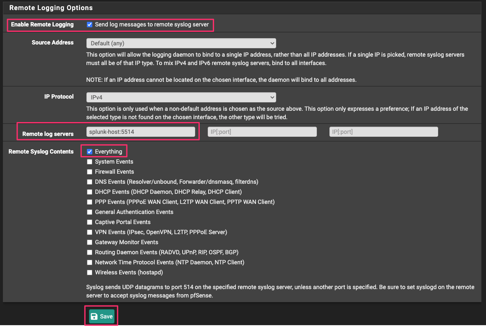

# pfSense Add-on for Splunk

## Overview

### About the pfSense Add-on for Splunk

|                       |                                                         |
|-----------------------|---------------------------------------------------------|
| Version               | 1.0.0                                                   |
| Vendor Products       | pfSense 2.5.0+                                          |
| Visible in Splunk Web | No.                                                     |

The **pfSense Add-on for Splunk** collects operational log data from pfSense Firewalls. You can install the Add-on on a forwarder to send data from pfSense to a Splunk Enterprise indexer or group of indexers. You can also use the add-on to provide data for other apps, such as Splunk Enterprise Security.

The **pfSense Add-on for Splunk** collects the following data using file inputs:

- Vulnerability Scan results sent from GVM to Splunk as scan tasks are completed.
- Changes to various GVM services log files in the `/var/log/gvm` directory and subdirectories.

### Source types for the pfSense Add-on for Splunk

The **pfSense Add-on for Splunk** provides index-time, search-time and CIM normalization for pfSense authentication, firewall, ids and other operational data in the following formats:

| Source Type                 | Description                                             | CIM Data Models                  |
|-----------------------------|---------------------------------------------------------|----------------------------------|
| pfsense:filterlog           | pfSense Firewall Logs                                   | Network Traffic                  |
| pfsense:dhcpd               | pfSense DHCP Logs                                       | Network Sessions                 |
| pfsense:openvpn             | pfSense OpenVPN Logs                                    | Network Sessions, Authentication |
| pfsense:nginx               | pfSense NGINX Logs                                      | N/A                              |
| pfsense:unbound             | pfSense DNS Resolver Logs                               | Network Resolution               |
| pfsense:snort               | pfSense Snort IDS Logs                                  | Intrusion Detection              |
| pfsense:php                 | pfSense WebConfigurator UI PHP Logs                     | N/A                              |
| pfsense:php-fpm             | pfSense WebConfigurator UI PHP FPM Logs                 | Authentication, Network Sessions |
| pfsense:syslogd             | pfSense Syslog Logs                                     | N/A                              |
| pfsense:filterdns           | pfSense DNS Filtering Logs                              | Network Resolution               |
| pfsense:/usr/sbin/cron      | pfSense CRON Logs                                       | Endpoint.Processes               |
| pfsense:dnsmasq             | pfSense DNS Forwarder Logs                              | Network Resolution               |
| pfsense:ntpd                | pfSense NTP Daemon Logs                                 | N/A                              |
| pfsense:miniupnpd           | pfSense MiniUPNP Logs                                   | N/A                              |
| pfsense:kernel              | pfSense Kernel Logs                                     | N/A                              |
| pfsense:check_reload_status | pfSense Filter Reload Logs                              | N/A                              |

Note: For Suricata data, use the [Suricata Add-on](https://github.com/ccl0utier/TA-suricata).

### Compatibility

This version of the add-on is compatible with the following platform, OS and CIM versions:

|                                  |                          |
|----------------------------------|--------------------------|
| Splunk Platform                  | 8.x and later            |
| CIM                              | 4.2 and later            | 
| Supported OS for data collection | Any supported by pfSense |

## Installation

### Install the pfSense Add-on for Splunk

You can install the **pfSense Add-on for Splunk** with Splunk Web or from the command line. You can install the add-on onto any type of Splunk Enterprise instance (indexer, search head, or forwarder).

1. Download the add-on from [Github](https://github.com/ccloutier-splunk/TA-gvm/releases) or alternatively clone the project using your `git` client.
2. Determine where and how to install this add-on in your deployment.
3. Perform any prerequisite steps before installing.
4. Complete your installation.

See Installing add-ons in Splunk Add-Ons for detailed instructions describing how to install a Splunk add-on in the following deployment scenarios:

- [Single-instance Splunk Enterprise](http://docs.splunk.com/Documentation/AddOns/released/Overview/Singleserverinstall)
- [Distributed Splunk Enterprise](http://docs.splunk.com/Documentation/AddOns/released/Overview/Distributedinstall)

### Distributed installation of this add-on

Use the tables below to determine where and how to install this add-on in a distributed deployment of Splunk Enterprise or any deployment for which you are using forwarders to get your data in. Depending on your environment, your preferences, and the requirements of the add-on, you may need to install the add-on in multiple places.

| Splunk instance type | Supported | Required    | Comments                                                                                          |
|----------------------|-----------|-------------|---------------------------------------------------------------------------------------------------|
| Search Heads         | Yes       | Yes         | Install this add-on to all search heads where pfSense knowledge management is required.           |
| Indexers             | Yes       | Yes         | Install this add-on to all indexers, it has index-time configurations.                            |
| Heavy Forwarders     | Yes       | Conditional | Required if you have Heavy Forwarders in your ingestion path or they perform data collection.     |
| Universal Forwarders | Yes       | Recommended | Install this add-on to the Universal Forwarders installed on your pfSense hosts to collect data.  |

### Distributed deployment compatibility

This table provides a quick reference for the compatibility of this add-on with Splunk distributed deployment features.

| Distributed deployment feature | Supported | Comments                                                         |
|--------------------------------|-----------|------------------------------------------------------------------|
| Search Head Clusters           | Yes       | N/A                                                              |
| Indexer Clusters               | Yes       | N/A                                                              |
| Deployment Server              | Yes       | Supported for deploying the configured add-on to multiple nodes. |


## Configuration

### Enable data and scripted inputs for the pfSense Add-on for Splunk

After you have installed the **pfSense Add-on for Splunk**, you must enable the data and network inputs within the add-on so that it collects data from your pfSense devices in your environment.
You must enable the inputs using the configuration files.

> Note: When you configure data and scripted inputs using configuration files, copy only the input stanzas whose configurations you want to change. Do not copy the entire file, as those changes persist even after an upgrade.

1. Create `inputs.conf` in the `$SPLUNK_HOME/etc/apps/TA-pfsense/local` directory.
2. Open `$SPLUNK_HOME/etc/apps/TA-pfsense/local/inputs.conf` for editing.
3. Open `$SPLUNK_HOME/etc/apps/TA-pfsense/default/inputs.conf` for editing.
4. Copy the input stanza text that you want to enable from the `$SPLUNK_HOME/etc/apps/TA-pfsense/default/inputs.conf.spec` file and paste them into the `$SPLUNK_HOME/etc/apps/TA-pfsense/local/inputs.conf` file.
5. In the `$SPLUNK_HOME/etc/apps/TA-pfsense/local/inputs.conf` file, enable the inputs that you want the add-on to monitor by setting the `disabled` attribute for each input stanza to `0` or alternatively removing it completely (the default is "enabled").
6. Save the `$SPLUNK_HOME/etc/apps/TA-pfsense/local/inputs.conf` file.
7. Restart the Splunk enterprise instance.

The recommended approach is to deploy the **configured** add-on to the relevant nodes using a **Deployment Server**.  

### (Optional) Configure the pfSense Add-on for Splunk to send data to another index or UDP port

You can (and likely should in most cases) send the collected data to a dedicated Splunk index.
You might also want to use another UDP port than the provided default (UDP/5514).

This can be achieved by creating the relevant index on your indexers and then adding:

```
index = myindexofchoice
```

... to the relevant input configuration stanza.  So if you wanted to send your pfSense data to an index named `network` and UDP/514, your configuration would look like this:

```
[udp://514]
index = network
sourcetype = pfsense
connection_host = dns
no_appending_timestamp = true
disabled = 0
```
> Note: This works for all input stanzas, i.e. `monitor` inputs.

### Enable the TCP input for Vulnerability Scan Data

Use the provided input stanza to enable the TCP input on your indexers by deploying the **configured** stanza to your indexers.

Alternatively, configure the UDP input using Splunk Web on your indexers:

1. Log into Splunk Web on your indexer (or Heavy Forwarder) node.
2. Navigate to **Settings** > **Data inputs**.
3. Click **+ Add New** next to **UDP**.
4. Enter the desired UDP port in the "Port" field (suggested: `5514`).
5. Optionally, enter allowed pfSense hosts as the value for "Only accept connection from".
6. Click **Next**.
7. Set the **Source type** as `pfsense`.
8. Optionally, select your preferred index instead of `Default`.
9. Review and save your UDP Input configuration.

### Enable sending log data from pfSense.

In order for pfSense to send its logs to Splunk, perform the following:

1. Log in to your **pfSense** instance using admin-level credentials and your favorite Web Browser.
2. Navigate to **Status** > **System Logs** > **Settings**.
3. Navigate to the **Remote Logging Options** section.
4. Configure the section as follows:

5. Make sure to:
	+ Enable `Send log messages to remote syslog server` under **Enable Remote Logging**.
	+ Change the value of **Remote log servers** to your Splunk instance (Indexer or Heavy Forwarder) where you configured the UDP Data Input using the configured UDP port value, e.g.: `192.168.0.100:5514`
	+ Enable `Everything` under **Remote Syslog Contents**.
6. Save your **Remote Logging Options** configuration.

Now that you have a proper configuration to send results to Splunk, events should start being ingested into Splunk.

## Troubleshooting

### General troubleshooting

For troubleshooting tips that you can apply to all add-ons, see [Troubleshoot add-ons](http://docs.splunk.com/Documentation/AddOns/released/Overview/Troubleshootadd-ons) in Splunk Add-ons.

### Missing Vulnerability Scan data

If no data is received from your pfSense devices, check the following:

1. Your UDP Data Input is properly configured on your relevant Splunk instance and listens for incoming data (Use `./splunk list udp` and/or `netstat -anu`).
2. Your pfSense device can reach your Splunk indexer/Heavy Forwarder where the UDP Input is configured over the selected UDP Port (firewall rules opened ).
3. Your pfSense device is properly configured to send log data from your pfSense device to your Splunk environment.
4. Review the system logs on the pfSense side as well as the internal Splunk logs for errors.
	
## Credits, References & Notes

This add-on was loosely based on the original Add-on published on Splunkbase [here](https://splunkbase.splunk.com/app/5613).

 “Netgate” and "pfSense" are trademarks of Netgate and they are in no way affiliated with this work.  Any rights, title and interest in these trademarks remains solely with them.

> Author: Christian Cloutier <ccloutier@splunk.com>
